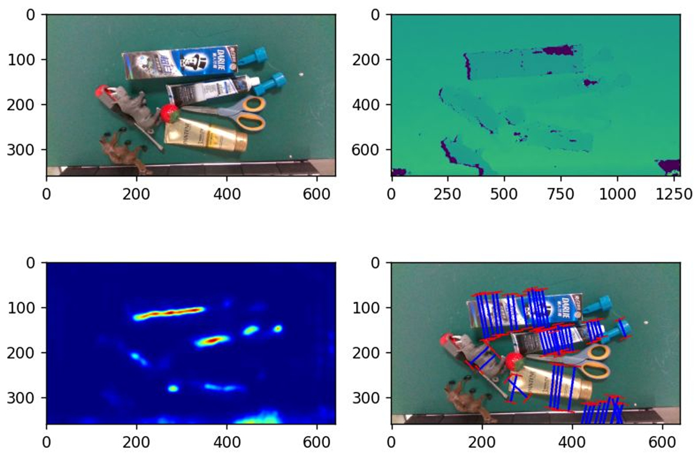
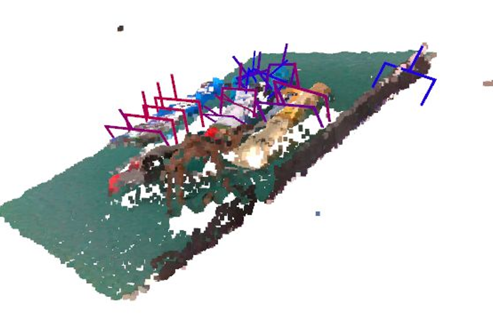

<h1 align="center">
  <b>HGGD-MCU</b>
</h1>

A microcontroller-compatible version of [Heatmap-Guided 6-DoF Grasp Detection](https://github.com/THU-VCLab/HGGD).


# Installation

### Requirements
- Python 3.9.13 (other versions at own discretion)
- [Microsoft C++ Build Tools](https://visualstudio.microsoft.com/visual-cpp-build-tools/)

### Code Installation
1. Download the code. It is recommended to create a virtual environment.
```bash
git clone https://github.com/ThomasVroom/HGGD-MCU.git
```
2. Install torch (with relevant CUDA toolkit; below is for python 3.9.13).
```bash
pip install torch torchvision --index-url https://download.pytorch.org/whl/cu121
```
3. Install fvcore and wheel separately.
```bash
pip install fvcore wheel
```
4. Download the code for [pytorch3d](https://github.com/facebookresearch/pytorch3d).
```bash
git clone https://github.com/facebookresearch/pytorch3d.git
```
5. Compile pytorch3d (this can take up to 30 minutes).
```bash
pip install --no-build-isolation ./pytorch3d
```
6. Install the remaining packages.
```bash
pip install -r requirements.txt
```

### Data Installation
To run the training / testing scripts, you need the following data:
- 3D Models: download `models.zip` from the [GraspNet](https://graspnet.net/datasets.html) dataset, unzip into `graspnet/`.
- Images: download train and test images from the [GraspNet](https://graspnet.net/datasets.html) dataset, unzip into `graspnet/scenes/`.
- Labels: download `realsense.7z` from [this link](https://cloud.tsinghua.edu.cn/d/e3edfc2c8b114513b7eb/), unzip into `data/`.

Note that it is not necessary to download any of this if you just want to run a forward pass through the model.
The data is only needed for running the training / testing scripts.

### Model Installation
TODO

# Usage

### Inference
`demo.py` performs a single forward pass through the model using the RGBD images and checkpoint in `resources/`.
The first output of the demo script is the visualization of the heatmap:



The top-left of this visualization shows the original RGB image, the top-right shows the original depth image, the bottom-left shows the grasp heatmap, and the bottom-right shows the predicted 2D grasps.

After closing this visualization, the predicted grasps are converted to 6D grasps and visualized using an interactive pointcloud:



The demo script can also be used for exporting the model as a series of optimized [onnx](https://onnx.ai/) files, which can be used to run the model on a microcontroller.
The hyperparameters of the model are controlled at the top of the file.

### Testing
`test_graspnet.py` performs accuracy tests on a subset of the GraspNet dataset using the checkpoint in `resources/`.
The testing results are saved in `logs/`.
The hyperparameters of the model and the testing are controlled at the top of the file.
The `scene-l` and `scene-r` parameters control what subset of the GraspNet data the model is tested on:

<center>

| GraspNet | `scene-l` | `scene-r` |
|----------|-----------|-----------|
| Seen     | 100       | 130       |
| Similar  | 130       | 160       |
| Novel    | 160       | 190       |

</center>

If you want to visualize some test cases (similarly to the demo script), you can add the index to the `vis_id` array in line 131.

### Training
`train_graspnet.py` performs the training of a model on a subset of the GraspNet dataset.
A log of the training can be accessed using [TensorBoard](https://www.tensorflow.org/tensorboard):
```bash
tensorboard --logdir=./logs/
```

The model is trained end-to-end, and the checkpoint(s) are also saved to the `logs/` directory.

# Changelog
Several changes have been made to the original HGGD model to make it compatible with microcontrollers.
The following list provides an overview of the most relevant changes made:
TODO

# Microcontrollers
TODO

# License

This repository is a fork of the original [HGGD](https://github.com/THU-VCLab/HGGD) implementation.
Their paper can be cited as follows:

```
@article{chen2023efficient,
  title={Efficient Heatmap-Guided 6-Dof Grasp Detection in Cluttered Scenes},
  author={Chen, Siang and Tang, Wei and Xie, Pengwei and Yang, Wenming and Wang, Guijin},
  journal={IEEE Robotics and Automation Letters},
  year={2023},
  publisher={IEEE}
}
```
